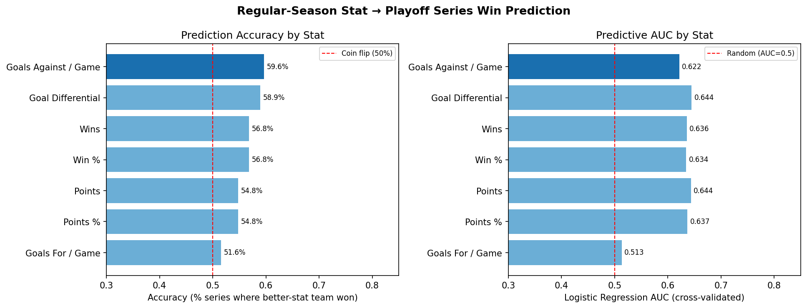
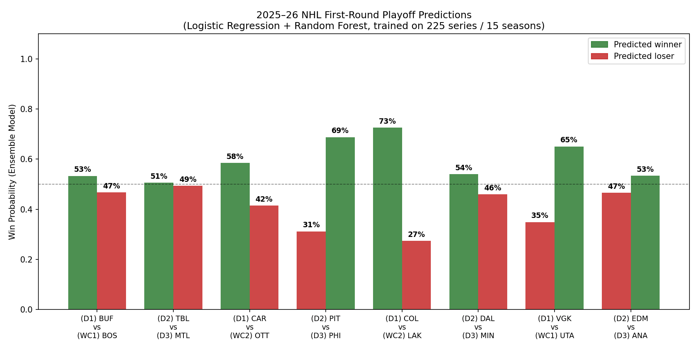

# NHL Playoff Predictor

How well does a team's regular-season record predict whether they win a playoff series — and which stat is the best predictor?

This project pulls data from the NHL Stats API across **15 seasons (2010–11 through 2024–25)**, builds a dataset of **225 playoff series matchups**, and ranks regular-season stats by their ability to predict which team wins. It also trains a predictive model and applies it to the **2025–26 first-round matchups**.

---

## Key Findings

### 1. Which regular-season stat best predicts playoff series wins?



**Goals Against / Game is the strongest single predictor**, with the team that allowed fewer goals per game during the regular season winning the playoff series **59.6%** of the time (AUC = 0.622). Defense travels in the playoffs.

Goal Differential is a close second at 58.9% accuracy — and actually edges out Goals Against on AUC (0.644), making it the more robust signal when you care about the *size* of the gap, not just the direction.

The top stats all cluster between 55–60%:

| Stat | Accuracy | r | AUC |
|---|---|---|---|
| Goals Against / Game | 59.6% | 0.215 | 0.622 |
| Goal Differential | 58.9% | 0.219 | 0.644 |
| Wins | 56.8% | 0.210 | 0.636 |
| Win % | 56.8% | 0.204 | 0.634 |
| Points | 54.8% | 0.220 | 0.644 |
| Points % | 54.8% | 0.223 | 0.637 |
| Goals For / Game | 51.6% | 0.024 | 0.513 |

A few things worth noting:
- **Goals For / Game is nearly random** at 51.6% — raw offensive output barely predicts playoff outcomes. It's goals *allowed*, not goals *scored*, that separates playoff winners.
- **All correlations are positive** across the full 15-season dataset, meaning every stat (except goals against, which is directionally correct when flipped) points the right way — but none of them point very hard. The ceiling on single-stat prediction is around 60%.
- Expanding from 7 to 15 seasons modestly reduced accuracy estimates across the board (the original 7-season dataset peaked at ~61.5%). More data gives a more honest picture.

**Accuracy degrades by round:** Goals Against / Game predicts Round 1 at 64.4% but drops to 50% by the conference finals — suggesting the further into the playoffs, the less regular-season stats matter.

---

### 2. Does finishing higher in the regular season predict winning the Cup?

Across 15 seasons, **only 1 of 15 Cup winners (6.7%) finished #1 overall in the regular season** — Chicago in the lockout-shortened 2012–13 season. Seven of fifteen (47%) finished in the top 4 league-wide; four winners finished outside the top 8.

Cup winners by regular-season league rank:

| Season | Champion | League Rank | Conf Rank |
|---|---|---|---|
| 2010–11 | BOS | #7 | #4 |
| 2011–12 | LAK | #13 | #8 |
| 2012–13 | CHI | **#1** | #1 |
| 2013–14 | LAK | #9 | #6 |
| 2014–15 | CHI | #7 | #4 |
| 2015–16 | PIT | #4 | #2 |
| 2016–17 | PIT | #2 | #2 |
| 2017–18 | WSH | #7 | #4 |
| 2018–19 | STL | #12 | #5 |
| 2019–20 | TBL | #3 | #2 |
| 2020–21 | TBL | #8 | — |
| 2021–22 | COL | #2 | #1 |
| 2022–23 | VGK | #4 | #1 |
| 2023–24 | FLA | #4 | #3 |
| 2024–25 | FLA | #11 | #5 |

**Average league rank of Cup winner: 6.3.** The champion is typically a good-but-not-dominant regular season team — hot at the right time. Florida's back-to-back wins (ranked #4 in 2024, #11 in 2025) are the starkest recent example of regular season record failing to predict the Cup.

---

### 3. 2025–26 First Round Predictions

A logistic regression + random forest ensemble trained on all 225 historical series (leave-one-season-out CV accuracy: **59.6%**) produces the following predictions for the 2025–26 playoffs:



**Eastern Conference**

| Series | Matchup | Predicted Winner | Confidence |
|---|---|---|---|
| A | (D1) BUF vs (WC1) BOS | **BUF** | 53.3% |
| B | (D2) TBL vs (D3) MTL | **TBL** | 50.6% — coin flip |
| C | (D1) CAR vs (WC2) OTT | **CAR** | 58.5% |
| D | (D2) PIT vs (D3) PHI | **PHI** | 68.8% — upset pick |

**Western Conference**

| Series | Matchup | Predicted Winner | Confidence |
|---|---|---|---|
| E | (D1) COL vs (WC2) LAK | **COL** | 72.6% — most confident |
| F | (D2) DAL vs (D3) MIN | **DAL** | 54.0% |
| G | (D1) VGK vs (WC1) UTA | **UTA** | 65.1% — upset pick |
| H | (D2) EDM vs (D3) ANA | **ANA** | 53.4% — slight upset |

The model's notable upset picks — PHI over PIT, UTA over VGK, and ANA over EDM — are driven by the lower-seeded teams having stronger defensive and goal differential numbers during the regular season, which the model weights most heavily. With a ceiling around 60% accuracy, treat these as probabilistic lean, not certainty.

---

## How to Run

```bash
# 1. Install dependencies
python -m venv .venv
source .venv/Scripts/activate   # Windows: .venv\Scripts\activate
pip install -r requirements.txt

# 2. Fetch raw data from the NHL API (standings + playoff brackets)
python scripts/fetch_data.py

# 3. Clean and process standings
python scripts/preprocess.py

# 4. Build per-series matchup dataset
python scripts/build_matchup_dataset.py

# 5. Run predictor analysis and generate leaderboard chart
python scripts/predictor_analysis.py

# 6. Generate 2025-26 first round predictions
python scripts/predict_2026.py

# 7. Explore interactively
jupyter notebook
```

---

## Project Structure

```
nhl_data/
├── data/
│   ├── raw/                          # Raw JSON from NHL API (gitignored)
│   └── processed/
│       ├── standings_all.csv         # 462 rows — one per team per season
│       ├── playoff_matchups.csv      # 225 rows — one per playoff series
│       ├── predictor_results.csv     # Stat leaderboard
│       └── predictions_2026.csv      # 2025-26 first round predictions
├── notebooks/
│   ├── 01_exploration.ipynb          # Standings EDA
│   ├── 02_predictor_analysis.ipynb   # Full predictor leaderboard + charts
│   └── 03_standings_vs_cup.ipynb     # Regular season rank vs. Cup winner
├── outputs/
│   ├── predictor_leaderboard.png     # Accuracy / r / AUC chart
│   └── predictions_2026.png          # 2025-26 first round prediction chart
├── scripts/
│   ├── fetch_data.py                 # Fetch standings + playoff brackets
│   ├── preprocess.py                 # Parse standings into CSV
│   ├── build_matchup_dataset.py      # Join series matchups with stats
│   ├── predictor_analysis.py         # Rank stats, generate leaderboard
│   └── predict_2026.py               # Train model, predict 2025-26 R1
└── requirements.txt
```

---

## Data Source

All data is fetched from the public [NHL Stats API](https://api-web.nhle.com/v1). No API key required. Seasons covered: 2010–11 through 2024–25 (15 seasons, excluding no playoffs in 2004–05 lockout).
